# 🚀 AWS Multi-Tier Architecture Project (EC2 + RDS + Auto Scaling)
A real-world AWS project demonstrating high availability and scalability using Auto Scaling and RDS.

## ⚠️ Challenges Faced

- Application Load Balancer showing outdated application data →

  After configuring the Load Balancer, the application was accessible via DNS, but it was displaying output from an older AMI version instead of retrieving updated data from the RDS database.

  Root Cause:
  The Auto Scaling Group was still using an older AMI in the Launch Template, so newly launched instances were running outdated application code.

  Resolution:
  - Created a new AMI with the latest application changes
  - Updated the Launch Template to use the latest AMI version
  - Reconfigured the Auto Scaling Group to use the updated template

  After these changes, the Load Balancer DNS correctly routed traffic to updated instances, and the application successfully retrieved data from the RDS database.

  This issue helped me understand the relationship between AMI, Launch Template, and Auto Scaling Group in AWS.

- RDS connectivity and data retrieval issues →

  Initially, the application was not able to retrieve data from the RDS database.

  Resolution:
  - Verified RDS endpoint configuration in the application
  - Ensured security groups allowed inbound MySQL (3306) traffic from EC2
  - Confirmed database credentials and connectivity

  After fixing these configurations, the application successfully connected to RDS and fetched data.

- Health check configuration issues →

  During Load Balancer setup, instances were marked unhealthy.

  Resolution:
  - Created a dedicated `/health.php` endpoint returning `OK`
  - Configured the Target Group health check path correctly

  This ensured proper health monitoring and allowed Auto Scaling to maintain healthy instances.

## 📌 Project Overview

This project demonstrates how to deploy a highly available PHP web application on AWS using EC2, Auto Scaling, and RDS.

## 🚀 Key Highlights

- Designed a scalable AWS architecture using EC2, ALB, and RDS
- Implemented Auto Scaling for high availability
- Configured health checks for fault tolerance
- Built and deployed a PHP application integrated with RDS

---
### AWS Multi-Tier Architecture
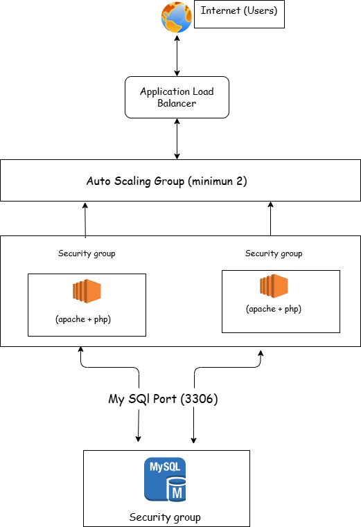

## Architecture Overview

- Amazon EC2 is used to host the PHP application
- Application Load Balancer distributes incoming traffic
- Auto Scaling ensures high availability and fault tolerance
- Amazon RDS (MySQL) is used as the backend database

---

## 🧠 Architecture Explanation

- User traffic is routed through the Application Load Balancer
- Load Balancer distributes requests across multiple EC2 instances
- Auto Scaling dynamically adjusts the number of instances
- EC2 instances communicate with RDS for database operations
- Health checks ensure system reliability

## 🔍 Architecture Flow

1. User sends request to Application Load Balancer
2. Load Balancer distributes traffic to EC2 instances
3. Auto Scaling maintains required number of instances
4. EC2 instances process requests and interact with RDS
5. Health checks monitor instance status
6. Unhealthy instances are replaced automatically

## ⚙️ Implementation Steps

1. Launched an EC2 instance using Ubuntu AMI
2. Installed Apache, PHP, and MySQL client
3. Deployed PHP application
4. Created an RDS MySQL database
5. Configured database and connected it to EC2
6. Created a custom AMI from configured instance
7. Created Launch Template using the AMI
8. Configured Auto Scaling Group (min: 2 instances)
9. Attached Application Load Balancer
10. Configured security groups and health checks
---

## 🔐 Security Group Configuration

- SSH (22) → Instance access
- HTTP (80) → Web traffic
- MySQL (3306) → EC2 to RDS communication

## 📸 Screenshots

### EC2 Instance
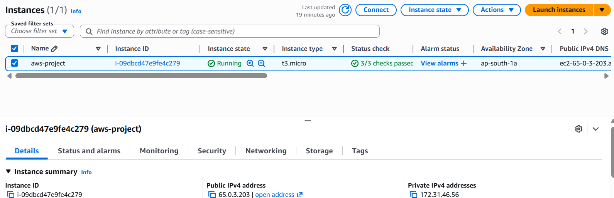

## 📸 PHP Application Working
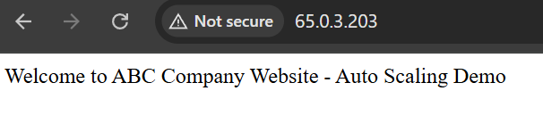

### ✅ Application Deployment Verification

The PHP-based web application was successfully deployed on the EC2 instance.

Accessing the public IP displays the custom application page:
"Welcome to ABC Company Website - Auto Scaling Demo"

This confirms:
- Apache is running
- PHP is configured correctly
- Application is accessible over HTTP

## ❤️ Health Check Endpoint

A health check endpoint is implemented for load balancer monitoring.

### Endpoint
`/health.php`

### Response
`OK`

### 📸 Health Check Output

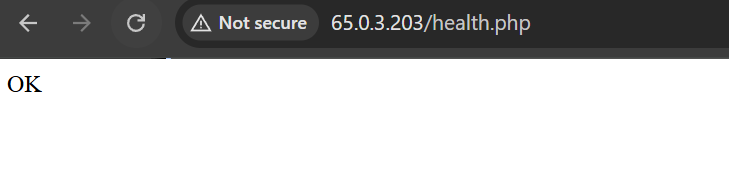

### Purpose
- Used by Application Load Balancer (ALB)
- Ensures instances are healthy
- Helps Auto Scaling replace unhealthy instances

## Create Custom AMI

A custom AMI was created from the configured EC2 instance so that Auto Scaling can launch pre-configured instances with Apache, PHP, and application code.

## 🚀 Launch Template Configuration

A Launch Template was created to define the configuration for EC2 instances used in Auto Scaling.

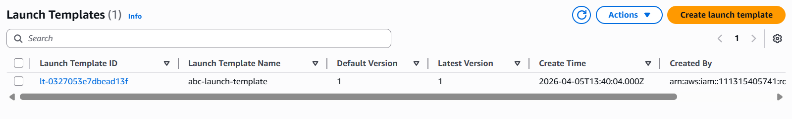

### Purpose
- Standardizes EC2 instance configuration
- Enables Auto Scaling to launch identical instances
- Ensures consistency across all instances

### ✅ Verification

The launch template was successfully created and will be used by the Auto Scaling Group to launch EC2 instances with predefined configurations.

### Auto Scaling Group
The Auto Scaling Group ensures that the application remains available by automatically replacing unhealthy instances and maintaining the desired capacity.
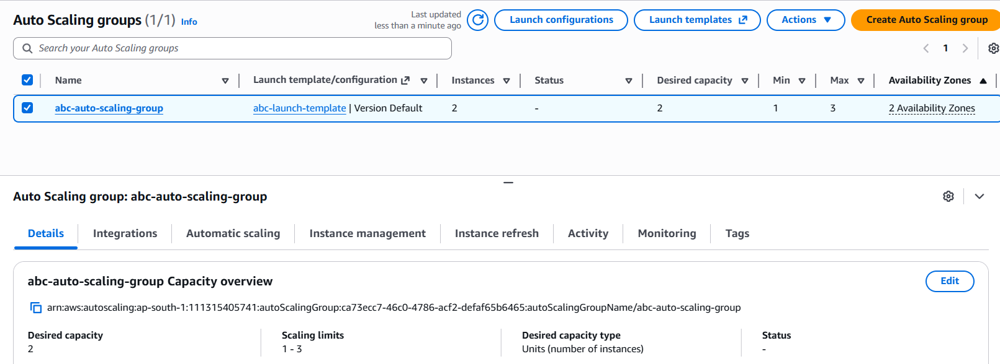

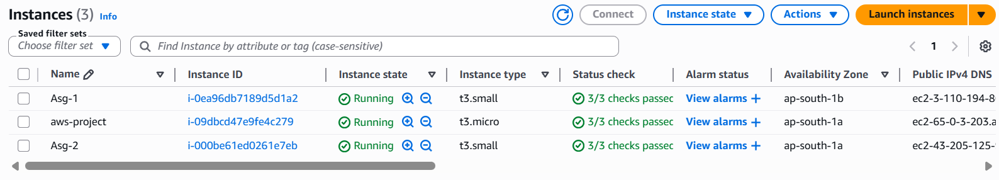

### Load-Balancer
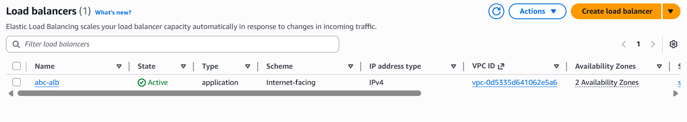

## 🌐 Load Balancer Output

The application is accessed via the Application Load Balancer DNS.
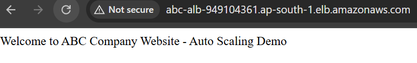

### Target-Group
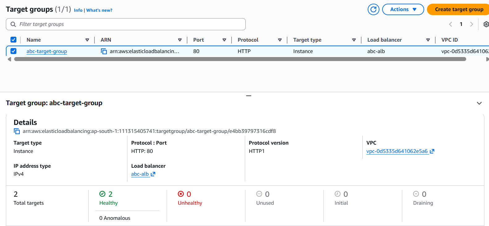

## 🗄️ RDS Database Setup

A MySQL database was created using Amazon RDS.

### 📸 Database Table

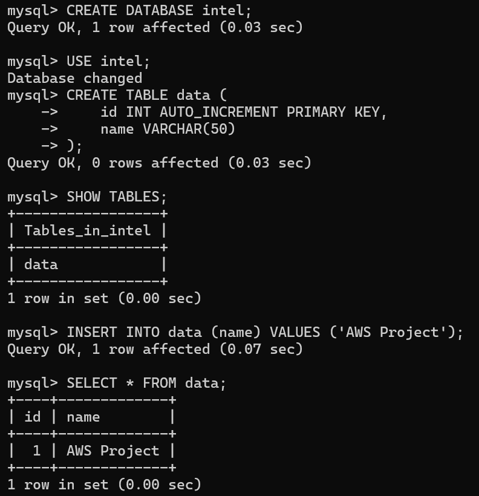

## Application Output

This confirms that the EC2-hosted PHP application is successfully connected to the RDS MySQL database.
The application successfully retrieves data from the RDS database:

Data from RDS:
ID: 1 - Name: AWS Project
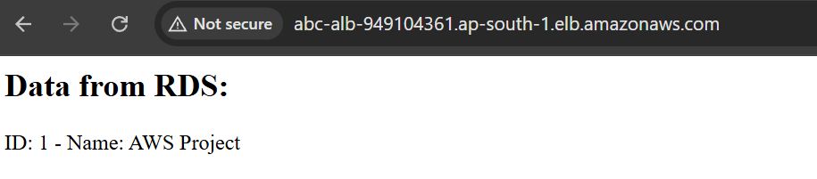

---

## 🛠️ Tech Stack

* AWS EC2
* AWS RDS
* Auto Scaling
* PHP
* MySQL

## ✅ Conclusion

This project provided hands-on experience in designing and deploying a highly available and scalable architecture on AWS. It strengthened my understanding of core cloud concepts such as load balancing, auto scaling, and database integration using Amazon RDS.

Through this implementation, I also gained practical knowledge of handling real-world scenarios like health checks, fault tolerance, and infrastructure reliability.
